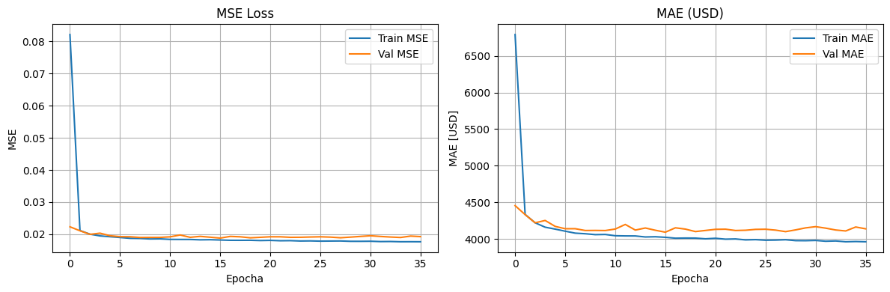
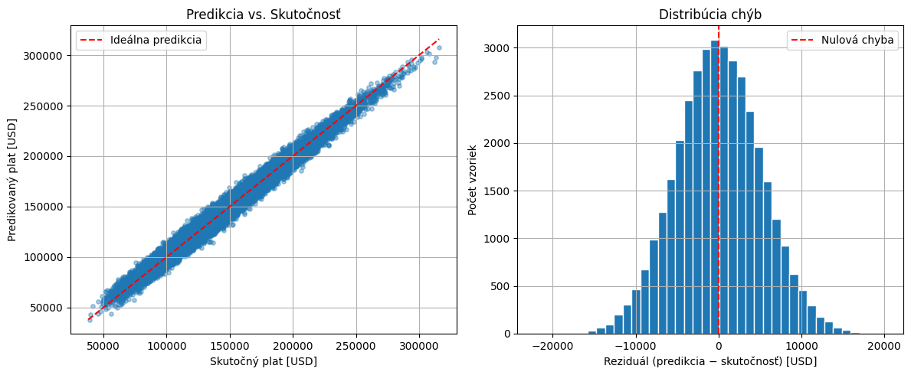
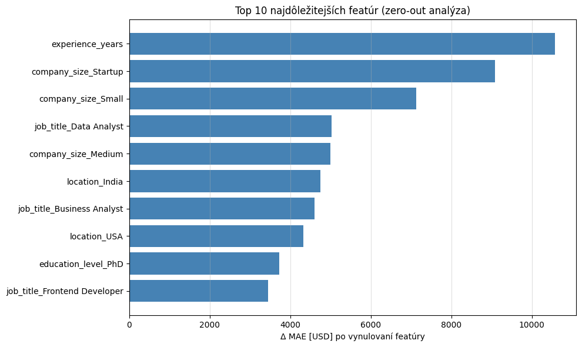

# Predikcia platu pomocou neurónovej siete

**Predmet:** Princípy a aplikácie neurónových sietí
**Úloha:** Regresia — predpovedať ročný plat (USD) na základe pracovných charakteristík
**Notebook:** [salary_nn.ipynb](salary_nn.ipynb)

## Setup

```bash
pip install -r req.txt
```

Dataset sa stiahne automaticky cez `kagglehub` (`nalisha/job-salary-prediction-dataset`).

---

## 1. Príprava a analýza dát

**Dataset:** `job_salary_prediction_dataset.csv`, **250 000 vzoriek**, 10 stĺpcov, žiadne chýbajúce hodnoty.

| Typ | Stĺpce |
|---|---|
| Numerické (3) | `experience_years` (0–20), `skills_count` (1–19), `certifications` (0–5) |
| Kategorické (6) | `job_title` (12), `education_level` (5), `industry` (10), `company_size` (5), `location` (10), `remote_work` (3) |
| Target | `salary` (31 867 – 333 046 USD; μ = 145 718, σ = 37 408) |

**Predspracovanie:**

1. **One-Hot Encoding** kategorických stĺpcov s `drop_first=True` → **42 vstupných čŕt**
   - `drop_first=True` redukuje multikolinearitu (k kategórií → k−1 stĺpcov; chýbajúca kategória je referenčná)
2. **Split 70 / 15 / 15** (train / val / test), `random_state=67` pre reprodukovateľnosť
   - Train: 175 000 | Val: 37 500 | Test: 37 500
3. **Štandardizácia featúr** (`(x − μ) / σ`, +1e−6 v menovateli proti deleniu nulou)
   - μ a σ fitnuté **iba na trénovacej množine** — val/test simulujú nasadenie na nevidené dáta
4. **PyTorch DataLoader**, batch size 64; `shuffle=True` pre train, `False` pre val/test

---

## 2. Architektúra modelu a zdôvodnenie

**`SalaryMLP`** — Multi-Layer Perceptron pre regresiu.

```
Input (42) → Linear(128) → ReLU → Linear(64) → ReLU → Linear(1)
```

- **13 825 parametrov**
- Výstupná vrstva: **1 neurón, bez aktivácie** (regresia musí vedieť predpovedať ľubovoľnú reálnu hodnotu)
- Lievikovitá redukcia šírky (128 → 64) — bežný vzor pre tabuľkové dáta
- **ReLU** aktivácia: rýchla, neutrpí vanishing gradientom

**Zdôvodnenie voľby:**
- Pri tabuľkových dátach s mixom numerických a one-hot featúr je MLP štandardnou baseline.
- Architektúra je zámerne **malá** — najprv overujeme, či je úloha vôbec riešiteľná feed-forward sieťou; až potom pridávame komplexitu.

---

## 3. Trénovací proces

| Parameter | Hodnota |
|---|---|
| Loss | `nn.MSELoss()` (mean reduction) |
| Optimizer | Adam, `lr = 1e-3` |
| Batch size | 64 |
| Max epochs | 200 |
| Early stopping | patience = 20 epôch na `val_loss` |
| Device | CUDA (GPU) |

**Prečo MSE:** hladká, derivovateľná, gradient čisto definovaný (`2(ŷ − y)`). Štandard pre regresiu.
**Prečo Adam:** adaptívny learning rate per-parameter, robustný default, rýchla konvergencia.
**Prečo early stopping:** zabráni pretrénovaniu, automaticky obnoví váhy modelu s najnižšou `val_loss`.

**Sledované metriky:**
- **MSE** — minimalizovaná loss (jednotky USD², trénovacia veličina)
- **MAE** — interpretovateľná metrika v USD (priemerná absolútna chyba predikcie)

---

## 4. Evaluácia a interpretácia (baseline)



> *Konvergovaný stav baseline modelu (Exp 0) — ukončený early stoppingom pri ~150 epochách. Porovnanie s ďalšími variantmi je v sekcii 6.*

| Metrika | Train | Val |
|---|---|---|
| MSE | ~25.0 M | ~27.3 M |
| MAE | **3 990 USD** | **4 174 USD** |
| RMSE (= √MSE) | ~4 999 USD | ~5 230 USD |

### Porovnanie s naivným baseline („predpovedaj vždy priemer")

| | Naivný baseline | Náš model | Zlepšenie |
|---|---|---|---|
| MAE | ~30 000 USD | 4 174 USD | **86 %** |
| MSE | ~1.4 mld | 27.3 M | **98 %** |

### Sanity-check rozloženia chýb

`RMSE / MAE = 5 230 / 4 174 ≈ **1.25**` → presne to, čo predpovedá teória pre normálne rozdelené reziduály (1.2533). Žiadne extrémne outliers, distribúcia chýb je „zdravá".

### Generalization gap

Train MAE 3 990 vs Val MAE 4 174 → rozdiel **~4.6 %**. Model **negeneralizuje zle** — pri 13k parametroch a 175k vzorkách žiadny náznak pretrénovania.

### Relatívna chyba

`4 174 / 145 718 ≈ **2.9 %** priemerného platu`.

### Vizualizácie



- **Scatter plot** predikcia vs. skutočnosť — body blízko diagonály = dobrá predikcia
- **Histogram reziduálov** — symetrický okolo nuly = nezaujatý model

---

## 5. Feature importance (zero-out analýza)

Pre každú vstupnú featúru sme zmerali, **o koľko stúpne test MAE**, keď ju vynulujeme v štandardizovanom priestore (`x = 0` ≈ priemer z train). Väčší nárast MAE = dôležitejšia featúra. Baseline test MAE = **4 091 USD**.

| # | Featúra | Δ MAE [USD] |
|---|---|---|
| 1 | `experience_years` | **+10 574** |
| 2 | `company_size_Startup` | +9 084 |
| 3 | `company_size_Small` | +7 133 |
| 4 | `job_title_Data Analyst` | +5 029 |
| 5 | `company_size_Medium` | +5 005 |
| 6 | `location_India` | +4 753 |
| 7 | `job_title_Business Analyst` | +4 609 |
| 8 | `location_USA` | +4 333 |
| 9 | `education_level_PhD` | +3 733 |
| 10 | `job_title_Frontend Developer` | +3 457 |



**Pozorovania:**

- **`experience_years` je dominantný** — jediný numerický feature, ktorý zďaleka prekonáva všetky OHE stĺpce. Vynulovať ho znamená stratiť ~10.6k USD presnosti, čo je 2.6× baseline MAE.
- **`company_size` je druhý najsilnejší signál** — tri z piatich top featúr sú dummies pre veľkosť firmy (Startup, Small, Medium; `Large` je referenčná kategória po `drop_first=True`). Štruktúra firmy nesie veľa platovej informácie.
- **Lokalita a job title** sú v top 10 zastúpené selektívne — model identifikoval konkrétne kombinácie (India, USA; Data Analyst, Business Analyst, Frontend Developer), ktoré sa platovo výrazne odchyľujú od priemeru.
- **`skills_count` a `certifications` v top 10 chýbajú** — model im pripisuje len malý vplyv, čo je konzistentné s tým, že v syntetickom datasete pravdepodobne nemajú silnú signálovú zložku.

---

## 6. Diskusia

**Čo funguje:**
- Model sa demonštrovateľne naučil úlohu (98 % redukcia MSE oproti baseline).
- Žiadne pretrénovanie napriek tomu, že nepoužívame regularizáciu (dropout, weight decay).
- Tréning je stabilný, loss konzistentne klesá.

**Kontext a limitácie:**
- Dataset je s vysokou pravdepodobnosťou **syntetický** (rovnomerné kategórie, čisté rozsahy, žiadne nuly). MAE ~4 200 USD je pravdepodobne blízko **irreducible error floor** — t.j. šumu v dátach, pod ktorý sa žiadny model nedostane.
- V reálnom svete by bola predikcia platov výrazne ťažšia (typicky 10–20 % MAE) kvôli skrytým faktorom (firma, manažér, vyjednávanie, benefity).
- Model neuvažuje **interakcie medzi featúrami** explicitne — feed-forward sieť ich vie aproximovať, ale nie tak efektívne ako napr. gradient boosting alebo wide-and-deep architektúry.

**Vyskúšané experimenty:** detailný záznam v [EXPERIMENTS.md](EXPERIMENTS.md). Stručne:

| # | Variant | Parametre | Konvergencia | Val MAE | Pozn. |
|---|---|---|---|---|---|
| 0 | Baseline | 13 825 | ~150 epôch | 4 174 USD | bez `y` štandardizácie |
| 1 | + štandardizácia `y` | 13 825 | **~20 epôch** | **4 116 USD** | ~7.5× rýchlejšia konvergencia |
| 2 | + hlbšia sieť | 52 225 | ~30 epôch | 4 158 USD | viac kapacity ≠ lepší výsledok |

**Hlavné zistenia:**

1. **Štandardizácia targetu nezlepšila MAE, ale ~7.5× zrýchlila konvergenciu** (Exp 1) — gradient pri targete v ráde 10⁵ má obrovskú škálu, štandardizácia ho dáva do rádu 1.
2. **Hlbšia sieť so 3.8× viac parametrami val MAE zhoršila** (Exp 2) — Train MAE klesol (3 987 → 3 921) ale Val MAE stúpol (4 116 → 4 158). Generalization gap sa zdvojnásobil (3.2 % → 5.7 %), čo je signál začínajúceho overfittingu.
3. **Spojený záver:** úzkym hrdlom modelu **nie je kapacita ani optimalizácia**, ale **šum dát**. Sme blízko irreducible error floor — pridať parametre znamená iba memorovať šum, nie zlepšovať generalizáciu.

### Záver

**Projekt je úspešný v tom najdôležitejšom zmysle.** Model dosiahol val MAE **4 116 USD** (2.9 % priemerného platu, 86 % zlepšenie nad naivným baseline), ale za týmto číslom stojí dôležitejšia metodologická story: **tri cielené experimenty s falsifikovateľnými hypotézami diagnostikovali, prečo sa nedá ísť výrazne ďalej.**

- **Exp 1 (štandardizácia `y`)** zrýchlila konvergenciu 7.5×, ale val MAE nezlepšila → **optimalizácia nebola úzkym hrdlom**.
- **Exp 2 (hlbšia sieť, 3.8× viac parametrov)** val MAE dokonca zhoršila → **ani kapacita modelu nebola úzkym hrdlom**.
- Záver oboch experimentov je konzistentný: úzkym hrdlom je **šum v dátach** (irreducible error floor).

**Realistická interpretácia:** dataset je takmer určite syntetický (rovnomerné kategórie, žiadne missing values, čisté rozsahy). 2.9 % MAE preto **neznamená**, že tento model je nasaditeľný na reálnu predikciu platov, kde by MAE bolo skôr 10–20 % kvôli skrytým faktorom (firma, manažér, vyjednávacia pozícia, benefity). Výsledok demonštruje **schopnosť modelu naučiť sa funkciu skrytú v čistých dátach**, nie produktový prediktor.

**Hlavná správa:** najmenší model (Exp 1) je z týchto troch variantov **optimálny** — pridanie kapacity by len znamenalo memorovanie šumu. Occamova britva v praxi.

---

## Štruktúra projektu

```
NeuralNetwork/
├── salary_nn.ipynb     # hlavný notebook (dáta → model → tréning → evaluácia)
├── data/               # dataset (sťahovaný automaticky)
├── req.txt             # Python závislosti
└── README.md
```
